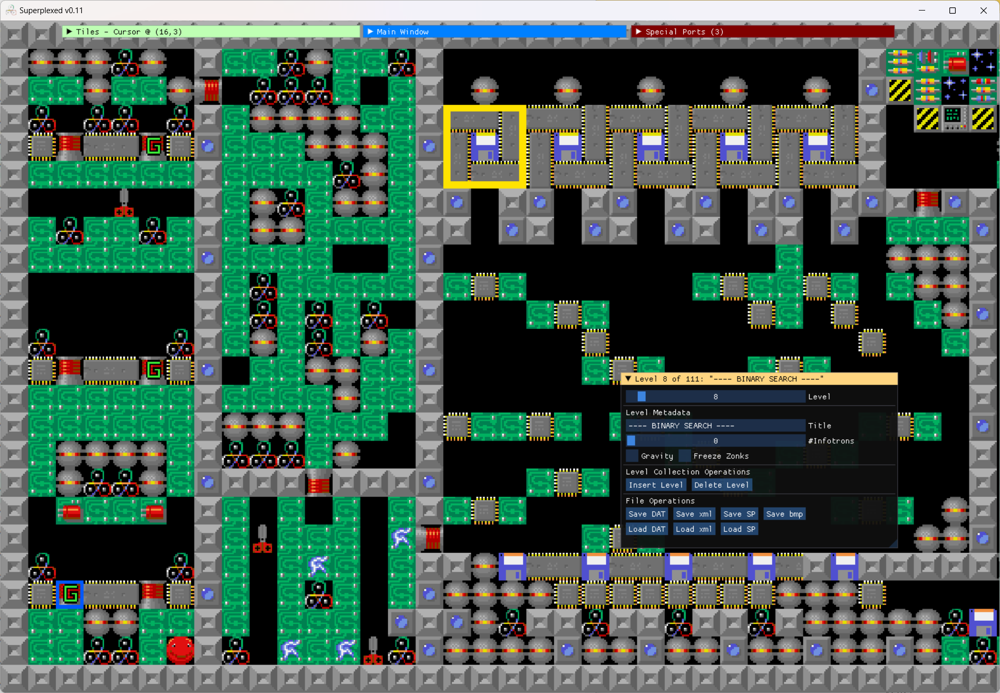

# Algorithms: A Supaplex levelset

Welcome to the "Supaplex: Algorithms" repository and release page. This is a levelset for Supaplex (DOS), created using my feature-rich [Superplexed](https://github.com/kaimitai/superplexed) editor.
  
Superplexed supports an xml format for Supaplex levels, and most files in this repository will be xml files representing levels made in the editor. Xml files are good for storing our work in a version control system like Git, and in the end we use Superplexed to turn the xml collection into a levelset DAT-file that Supaplex can read; and the releases will consist of this one DAT-file.

The last version of the generated level set can be downloaded from the [releases page](https://github.com/kaimitai/supaplex-algorithms/releases), and will contain a file algorithms.dat with the levelset until that point, and a 111-levels levelfile LEVELS.DAT which can be used by the DOS version of supaplex. The levels not yet implemented in the latter will be blank "dummy" levels.

###### Superplexed Editor Window

### 2022-11-19: Release 1

* First 8 levels, as they were posted on [Supaplex Online](https://www.supaplex.online/play/?levelset=kaimitai_algorithms.DAT&level=1)
